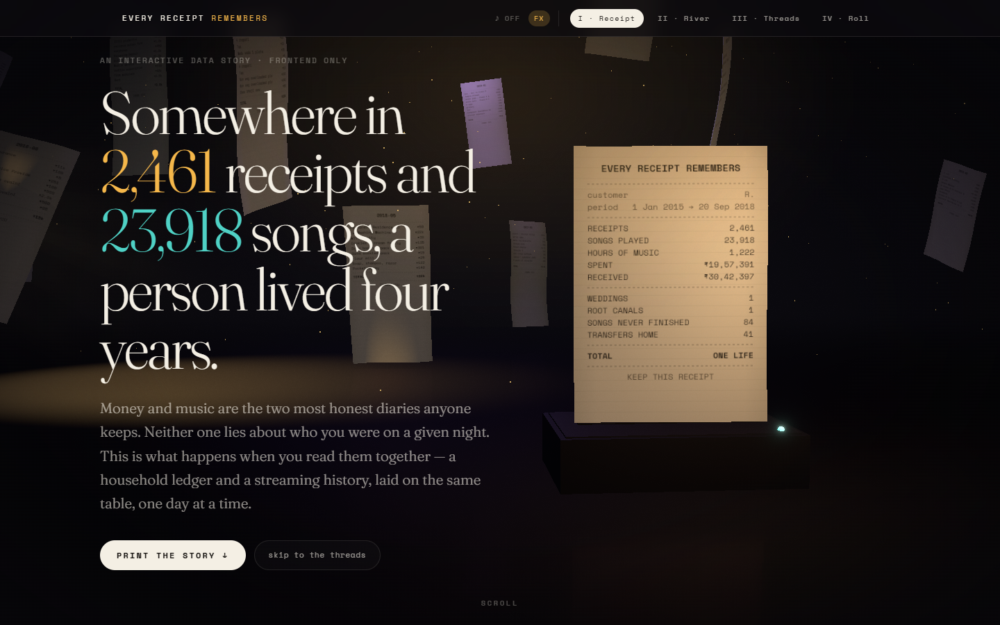
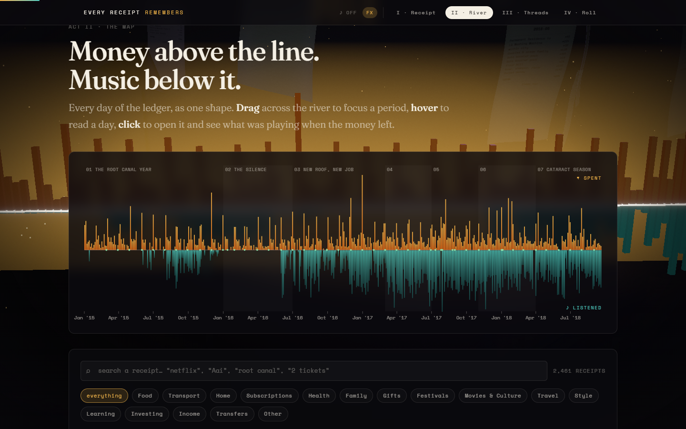
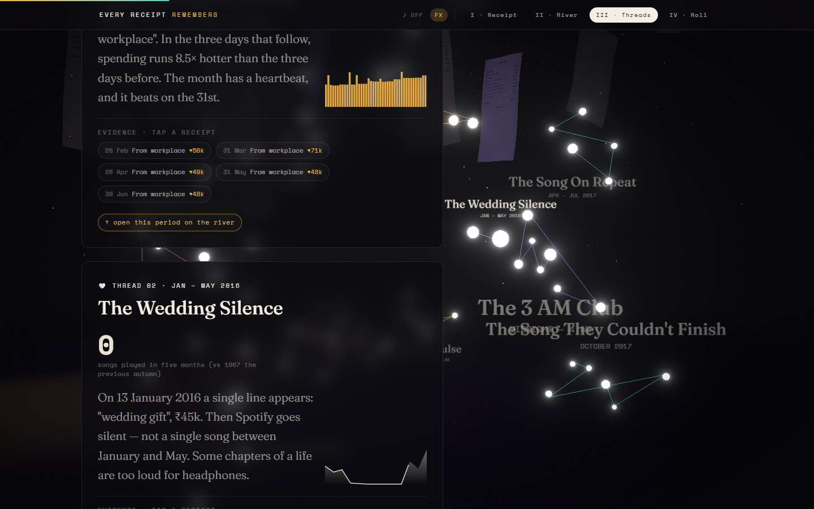
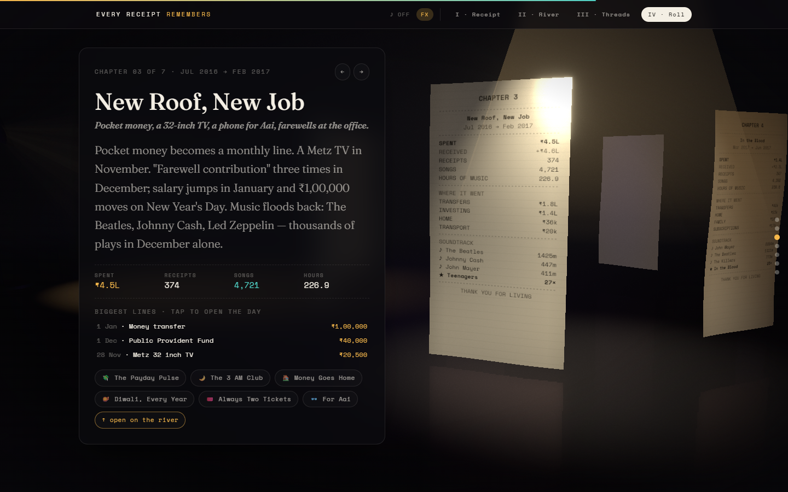
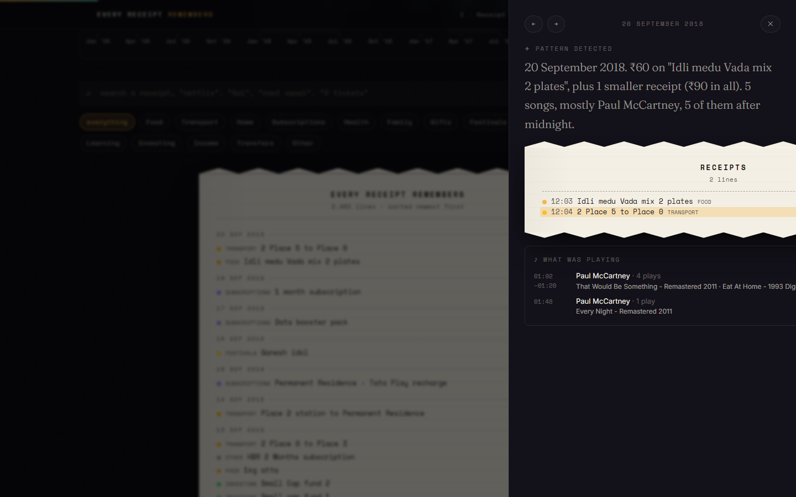
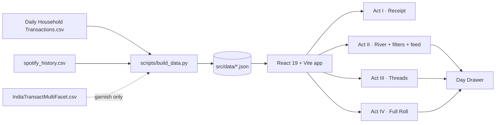

# Every Receipt Remembers

> *Somewhere in 2,461 receipts and 23,918 songs, a person lived four years.*

An interactive, frontend-only data story built for the **"Your Life, In Receipts"** challenge track. It takes two provided datasets — a household transaction ledger and a Spotify streaming history — lays them on the same table, and reads them as one life: money above the line, music below it.



---

## The idea

Money and music are the two most honest diaries anyone keeps. Neither one lies about who you were on a given night. Individually the records are trivial — ₹30 for a train, one play of a Beatles song. Read together, day by day, they reveal a wedding, a job change, a summer of hospital bills, a song that was pressed play on 84 times and never finished.

The experience is structured as four acts, following the brief's arc of **Raw Data → Insights → Connections → Story**:

| Act | What it is | Brief requirement it satisfies |
|---|---|---|
| **I · The Receipt** | A title card, then a desk at night: a thermal printer on the desk prints the four-year summary in real time — the paper rises out of the slot in feed steps under a lamp whose beam you can see in the air — while real receipts (painted from actual ledger rows) drift through the room. | Interactive storytelling hook |
| **II · The River** | Every day of the ledger as one shape: spending up, listening down. Brush to focus, hover to read, click any day or any receipt line to open it. Fuzzy search + category chips. The camera drops to desk level and tracks along the same data as terrain: every week a bar, spending above a glowing waterline, listening below it, and the range you brush on the chart lights up on the terrain. | Exploration · filtering/search/navigation · visual representation of the journey |
| **III · The Threads** | Ten patterns found by a detector pass that reads *both* diaries at once — payday pulses, the wedding silence, the 3 AM club, money going home, the song that wouldn't play. Every number links back to a real receipt. Beside the cards, the same evidence hangs as a slowly turning constellation, one colour per thread; the cluster of the card you are reading swells and its label brightens. | Meaningful mechanism for discovering relationships |
| **IV · The Full Roll** | The seven chapters stand as receipts in a ring on the desk. Scrolling turns the ring; the chapter facing you steps forward under its own spotlight and a glass panel tells it — prose, stats, biggest lines (tap to open the day), related threads. Each chapter appears exactly once. Then the credits: every receipt gathers into one slow spiral as the camera pulls back. | Story · visual journey |

Opening any day shows the **Day Drawer**: the receipts on the left, what was playing on the right, and a one-sentence "pattern detected" diary line composed from those rows. ← / → step through days; Esc closes.






---

## What is real, and what is interpretation

**Real.** Every rupee, date, note, song, artist and timestamp comes from the provided files:

- `Daily Household Transactions.csv` — 2,461 ledger lines, 1 Jan 2015 → 20 Sep 2018.
- `spotify_history.csv` — 149,860 plays; filtered to the same window and to plays ≥ 30 s → 23,918 plays, 1,222 hours. Timestamps are UTC in the source and are shown in IST.
- `Augmented_IndiaTransactMultiFacet2024.csv` — inspected and set aside: it is a noisy, multi-customer synthetic fraud dataset (random cities/coordinates, `is_fraud`, ~50% nulls) and not one person's life. It is only used for an optional "places" garnish (`places.json`) that the current UI does not render.

**Interpretation.** The two files were kept by different people. Reading them as one composite protagonist — named only **R.** — is the deliberate creative move of this piece and is disclosed on the page. Chapter titles and thread captions are generated from the numbers by small deterministic rules in `scripts/build_data.py`; the per-day diary lines are generated at runtime in `src/lib/diary.ts`. No fake photos, messages or chat logs were invented: where the brief lists categories the data does not contain, the app derives a narrative layer from real rows instead and labels it "✦ pattern detected".

---

## Threads the detector finds

| Thread | What it reads | Finding |
|---|---|---|
| The Payday Pulse | salary rows × spending in the 72 h before/after | 8.5× more spent after payday than before |
| The Wedding Silence | "wedding gift" row × monthly play counts | ₹45,000 gift on 13 Jan 2016, then **zero** plays for five months |
| The Song On Repeat | rolling 90-day window per track | "In the Blood" — John Mayer, 28× in 88 days (Apr–Jul 2017) |
| The Song They Couldn't Finish | starts that ended within 1 s (unfiltered log) | "Married with Children" — Oasis, 84 starts in Oct 2017, 10 finished |
| The 3 AM Club | plays by hour of day (IST) | 23% of all listening between midnight and 4 AM |
| Money Goes Home | ≥ ₹10k transfers, consecutive-month streaks | 41 transfers, ₹6.0L, 20-month unbroken streak |
| The Hospital Summer | health cluster Jul–Sep 2017 × travel × plays | 18 medical receipts beside a ₹63k trip; loudest month of the story |
| Diwali, Every Year | festival rows × artists in ±3 days | 5 festivals, ₹306 median line, on schedule every year |
| Always Two Tickets | movie rows containing "2" | 8 of 9 cinema receipts say "2 tickets", all after the wedding |
| For Aai | notes matching Aai / glasses / cataract / thyroid | ₹43.4k across 13 receipts for someone else's eyes and phone |

---

## Architecture

```
Frontend/
├── scripts/
│   ├── build_data.py      # build-time pipeline: 3 CSVs → 7 small JSON files (runs once, never in the browser)
│   └── shots.mjs          # visual-QA screenshots via the installed Edge (dev only)
├── src/
│   ├── data/              # generated JSON (committed; ~1.3 MB total, listens/tracks are lazy-loaded)
│   ├── lib/
│   │   ├── types.ts       # shapes shared with build_data.py
│   │   ├── data.ts        # typed access + lazy listens index
│   │   ├── store.ts       # Zustand: range · groups · query · open day · active thread
│   │   ├── world.ts       # scroll → 3D world state (no React re-renders), jumpToChapter
│   │   ├── sound.ts       # synthesized ambience + printer ticks (WebAudio, opt-in)
│   │   ├── diary.ts       # runtime "pattern detected" sentence
│   │   └── format.ts      # ₹ / date helpers, category labels + colours
│   ├── components/
│   │   ├── receipt/       # ReceiptStrip (the visual identity), ReceiptFeed
│   │   ├── river/         # RiverOfDays — D3 scales + brush, React-rendered SVG
│   │   ├── threads/       # ThreadCard
│   │   ├── filters/       # FilterBar (Fuse.js search + chips)
│   │   ├── shared/        # AnimatedCounter, Sparkline, SectionHeading
│   │   ├── three/         # World, WorldMount, paperTexture, labelSprite, useSceneGate
│   │   │   └── set/       # Desk · Lamp · Printer · Sheets · RiverTerrain · Constellation · Ring · EndHelix · CameraRig · Effects
│   │   ├── DayDrawer.tsx  # the connection view
│   │   ├── Nav.tsx        # progress bar + act links
│   │   └── Colophon.tsx   # what is real / what is interpretation
│   └── acts/              # ActI_Hook · ActII_River · ActIII_Threads · ActIV_FullRoll
└── docs/                  # screenshots
```



**Stack:** React 19 · TypeScript · Vite · Tailwind CSS v4 · Motion (Framer) · D3 (scale, brush, time) · three.js + React Three Fiber + drei + postprocessing · Zustand · Fuse.js. No backend, no runtime CSV parsing, no external API, no asset files — every texture is painted at runtime from the data.

**3D — a film set, not a backdrop:** one persistent `<Canvas>` (`src/components/three/World.tsx`) with a designed set in `src/components/three/set/`: `Desk` (reflective surface), `Lamp` (spot light + a shader-drawn volumetric beam), `Printer` (clip-plane receipt that prints in feed steps), `Sheets` + `Dust` (the room's air), `RiverTerrain` (instanced bars for 195 weeks, synced to the 2D brush), `Constellation` (instanced glowing nodes + label sprites, synced to the card in view), `Ring` (seven chapter receipts + a spotlight that follows the active one), `EndHelix` (the credits spiral). `CameraRig` treats the camera as a character: each act is a shot (dolly-in, tracking, orbit, wide, pull-back) and scrolling cross-fades between them. `Effects` adds bloom, film grain and a vignette. `src/lib/world.ts` holds a tiny mutable scroll state written by one listener and read inside `useFrame`, so scrolling never re-renders React. Every 3D receipt is painted from real ledger text (`paperTexture.ts`) — no font files, no images, no external assets. `useSceneGate.ts` mounts the world only with WebGL and without `prefers-reduced-motion`; three.js ships in its own lazy chunk that the first paint never downloads; the **FX** toggle in the nav switches to a lighter render path (and defaults off on ≤4-core devices); the **♪** toggle plays a synthesized room tone and printer ticks (WebAudio, no audio files, off by default).

**Performance:** the raw CSVs are pre-aggregated once at build time; the initial bundle carries only the ledger + daily aggregates (~90 KB gzipped), the 24k-row listening log and track dictionary load on first day-open, and Acts III/IV are code-split behind the fold.

**Accessibility:** semantic landmarks (`nav`, `main`, `section`, `article`, `footer`), a skip link, keyboard-operable filters/drawer (Tab, Enter, ←/→, Esc), `aria-pressed` chips, `aria-live` result count, visible focus rings, `role="dialog"` drawer, and a full `prefers-reduced-motion` path (`MotionConfig reducedMotion="user"` + a CSS kill-switch) that collapses every animation to instant.

**Responsive:** tested at 390 px and 1440 px; the River re-bins days to the available width, the drawer becomes full-screen, and there is no horizontal scroll.

---

## Run it

```bash
# 1. (optional) regenerate the JSON from the raw CSVs — requires Python 3.11 + pandas
#    expects the extracted CSVs in ../Data/extracted/{a1,a2,a3}/
npm run build:data

# 2. develop
npm install
npm run dev          # http://localhost:5173

# 3. ship
npm run build        # static site in dist/ — deploy to Vercel / Netlify / GitHub Pages as-is
npm run preview
```

---

## Known limitations

- The two diaries belong to different real people; the composite is a storytelling device, stated in the Colophon.
- Ledger rows without a time of day are placed at 00:00, so they never count toward the 3 AM thread.
- The Spotify IST conversion is an assumption (the ledger is clearly Indian; the streaming file has no timezone).
- The third dataset is deliberately unused in the UI because its rows are not one person's life.
- The 3D scene mutates three.js objects inside `useFrame` (the React Three Fiber idiom), so the React purity lint rules are scoped off for `src/components/three/**` in `.oxlintrc.json`.
# Your-Life-In-Receipts

